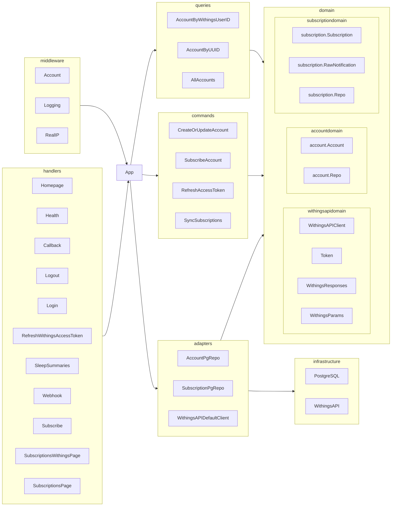

# Domain-driven design

## Dependency graph

```mermaid
flowchart LR;

subgraph handlers
    direction LR
    Homepage
    Health
    Callback
    Logout
    Login
    RefreshWithingsAccessToken
    SleepSummaries
    Webhook
    Subscribe
    SubscriptionsWithingsPage
    SubscriptionsPage
end
handlers-->App

subgraph middleware
    direction LR
    Account
    Logging
    RealIP
end
middleware-->App


App-->commands
App-->queries
App-->adapters


subgraph infrastructure
    direction LR
    PostgreSQL
    WithingsAPI
end


subgraph adapters
    direction LR
    AccountPgRepo
    AccountPgRepo
    SubscriptionPgRepo
    SubscriptionPgRepo
    WithingsAPIDefaultClient
    WithingsAPIDefaultClient
end
adapters-->infrastructure
adapters-->domain


subgraph commands
    direction LR
    CreateOrUpdateAccount
    SubscribeAccount
    RefreshAccessToken
    SyncSubscriptions
end
commands-->domain

subgraph queries
    direction LR
    AccountByWithingsUserID
    AccountByUUID
    AllAccounts
end
queries-->domain

subgraph domain
    direction LR
    accountdomain
    subscriptiondomain
    withingsapidomain
end


subgraph withingsapidomain
    direction LR
    WithingsAPIClient
    Token
    WithingsResponses
    WithingsParams
end

subgraph accountdomain
    direction LR
    account.Account
    account.Repo
end

subgraph subscriptiondomain
    direction LR
    subscription.Subscription
    subscription.RawNotification
    subscription.Repo
end

```