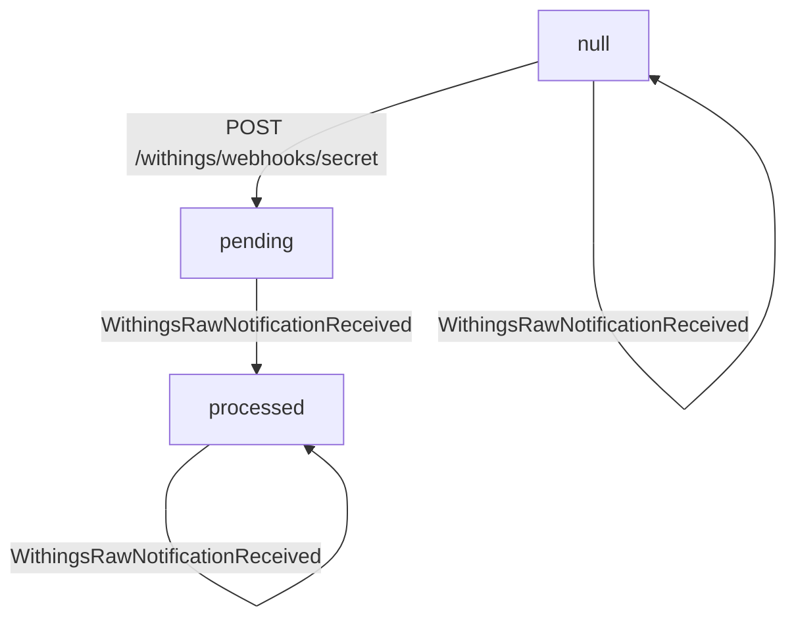
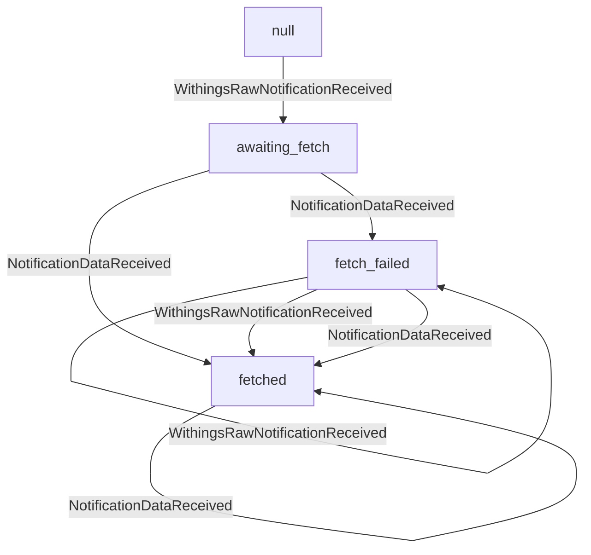

# Notification processing

## Timeline
- Withings calls our webhook
- RawNotification is created in DB
- RawNotificationReceived event is emitted
- Notification is created in DB
- NotificationReceived event is emitted
- Notification data is fetched
- Notification data is added to the notification in DB
- NotificationDataFetched is emited

## Raw notification status finite state machine

TODO: Implement all these state transitions in the code

## Notification data finite state machine

"awaiting_fetch"
"fetched"
"fetch_failed"

`notification.data_status` flowchart:

TODO: Implement all these state transitions in the code