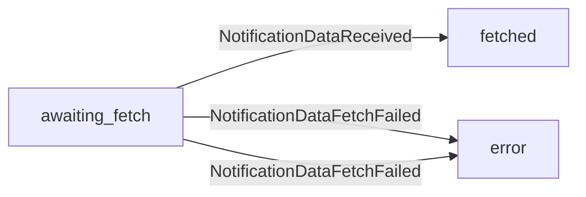

# Notification processing

## Timeline
- Withings calls our webhook
- RawNotification is created in DB
- RawNotificationReceived event is emitted
- Notification is created in DB
- NotificationReceived event is emitted
- Notification data is fetched
- Notification data is added to the notification in DB
- NotificationDataFetched is emited

## Notification data finite state machine

`notification.data_status` flowchart:

