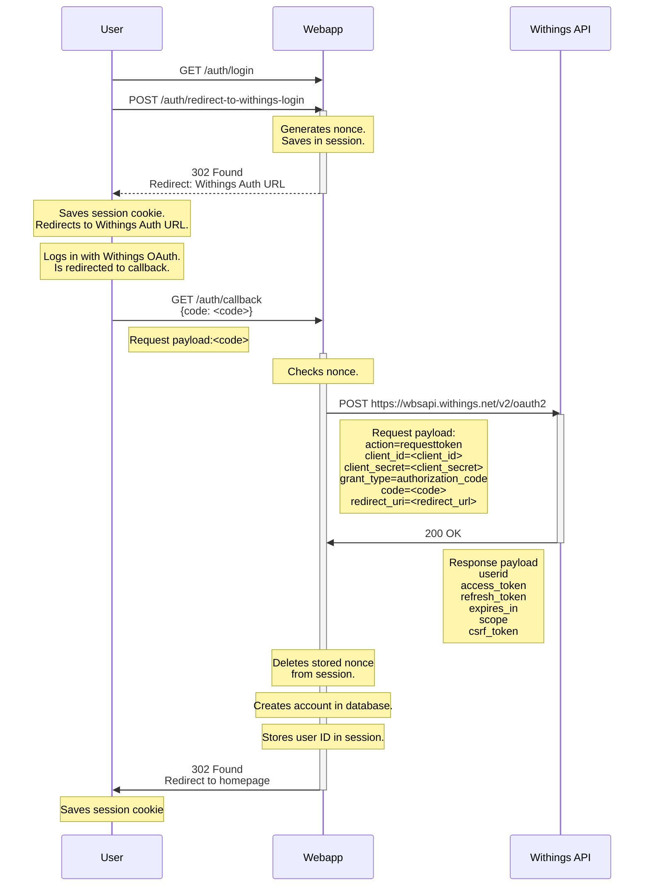

# Account registration sequence

## Initial registration

Flow when user has never logged in before and an account needs to be created.

- User has never logged in before.
- Users clicks login link
- User logs in with Withings auth provider
- User is redirected to Withoutings callback
- Webapp retrieves access token from Withings
- Webapp creates an account in the database
- Webapp stores user ID in session

fdsfdsf