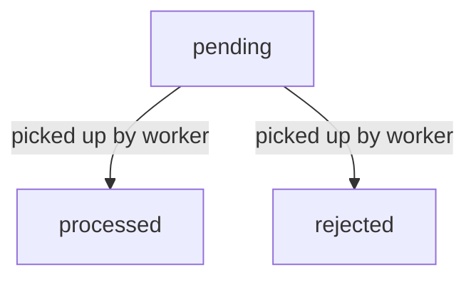

# Subscriptions

## Overview

Each account can subscribe to notifications (webhook events) from withings. One account requires one subscription per notification category.

## Subscription flow

### Subscribing
- Send a NotifySubscribe request to the withings API using the access token for the account, and the notification category.
- Repeat for every desired category.

### Unsubscribing
- Happens automatically if we don't respond to webhook HTTP requests with a 200 OK.

## Processing notifications

### Webhook HTTP request payloads are stored as raw notifications
- Incoming notifications are immediately stored in the database as a "raw" notification, to ensure that we respond with a 200 OK immediately.
- There is no authentication for incoming webhook requests, but the webhook URL is not public, and the incoming IP address is checked against a whitelist of withings IP addresses (_TODO_).

**Raw notifications state transitions**

### Async worker converts raw notifications into notifications
- TODO: Raw notifications are processed asynchronously by a worker process.
- TODO: The Withings user ID in the notifications is used to look up the account in the database. If the account is not found, the notification is rejected.
- TODO: The full notification payload is retrieved from the withings API using the access token for the account and the parameters in the raw notification.
- It is stored as a notification in the database.

